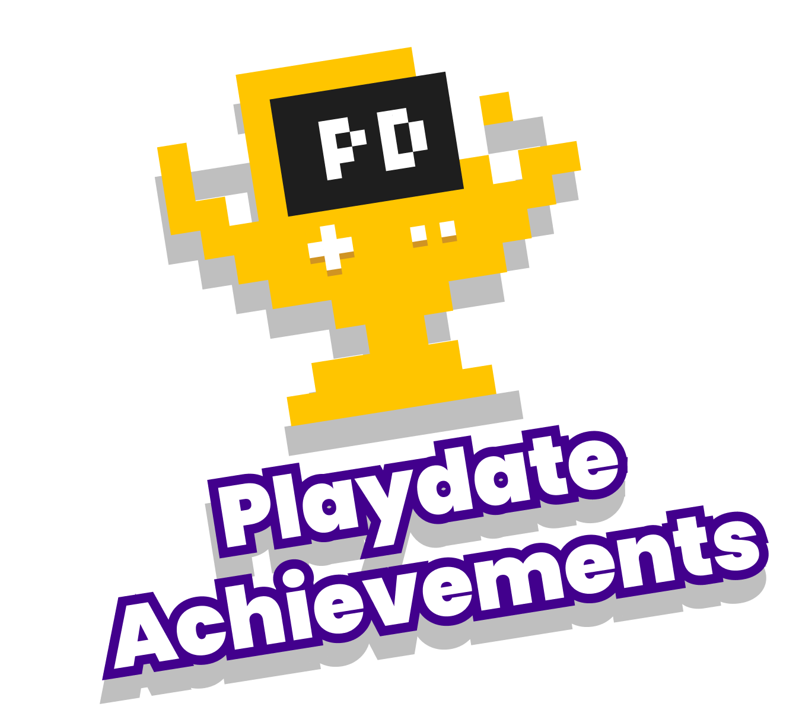

# 🏆 Playdate Achievements

##### An open achievement standard for the Playdate console.

1. _Play_ Playdate games!
2. _Earn_ achievements!
3. _View_ them in your Trophy Case!

Playdate Achievements is a community project establishing an open standard for achievements in [Playdate](https://play.date)™ games. Playdate is fun! Games on Playdate are fun! Achievements in games on Playdate are fun! Having a standard ensures a consistent experience for players, and makes it possible to view achievements earned across games in one place.






	

	
{{ site.data.games | size }}

		Games to Play
	

	

		
{{ achievementCount }}

		Achievements to Earn
	

 <!-- hero section -->

## _Everything_ On Display

[Trophy Case](https://gurtt.dev/trophy-case) is a dedicated viewer which displays the achievements you’ve earned across _all_ Playdate games in one place. Trophy Case was designed in parallel with the Playdate Achievements standard, providing first-class support for its features and showcasing any games which choose to integrate with it.

Of course, games may also present their earned achievements themselves. Additionally, the open standard makes it possible for others to create dedicated achievement viewer apps in the future.

 <!-- trophy case section -->

## Show Me the Games!

It’s all about the games. Here’s a (non-comprehensive) list of games that award Playdate Achievements. Made your own? [Add it to the list!](#made-a-game-for-playdate)




	<a href="{{ game.url }}">
		

		
{{ game.achievementCount }}

		
{{ game.title }}

		
By {{ game.author }}

    </a>



* These games are available to play now and will support Playdate Achievements in a future update.

 <!-- game grid -->

### Made a Game for Playdate?

The Playdate Achievements framework makes it quick and easy to add achievements to your game! [Check out the Getting Started Guide](https://github.com/PlaydateSquad/pd-achievements/blob/main/README.md) in the [`pd-achievements` repo](https://github.com/PlaydateSquad/pd-achievements), which provides simple instructions along with everything you need to:

1. Grant achievements that integrate with Trophy Case.
2. Notify players when they earn achievements. _(optional)_
3. Display an in-game achievements viewer. _(optional)_

Don’t forget to [add it to this page](https://github.com/PlaydateSquad/pd-achievements#contributing) when you’re finished!

 <!-- games section -->

## FAQ



{{ faq.question }}
{{ faq.answer | markdownify }}



Playdate is a registered trademark of [Panic](https://panic.com/). Playdate Achievements is a community project, and is not affiliated with, endorsed by, or sponsored by Panic (but we’re confident they think it’s cool).



This site is open source. .



 <!-- footer -->

 <!-- faq section -->
